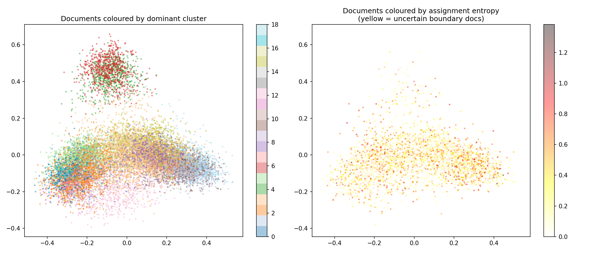

# Newsgroups Semantic Search and Caching System

This repository contains a lightweight, cluster-aware semantic search system built for the **20 Newsgroups dataset**. It was developed from first principles without relying on heavy external infrastructure like Redis or dedicated vector database servers.

---

## 📂 Project Structure

* **`src/main.py`**: FastAPI application and state management.
* **`src/cache.py`**: Custom cluster-aware semantic cache.
* **`src/clustering.py`**: Gaussian Mixture Model (GMM) clustering logic and BIC analysis.
* **`src/vectordb.py`**: Custom NumPy-based vector store and embedding logic.
* **`src/data_processor.py`**: Text extraction, cleaning, and regex-based noise reduction.
* **`data/`**: Contains pre-computed embeddings, metadata, the trained GMM model, and generated clustering visualizations.
* **`Dockerfile` & `docker-compose.yml`**: Containerization configuration.

---

## 🚀 How to Run

### Option 1: Docker (Recommended)
The service is fully containerized and will start cleanly with a single command. It automatically loads the pre-computed models and data.

1.  **Clone this repository.**
2.  **Run the following command in the root directory:**
    ```bash
    docker compose up --build
    ```
3.  **Access the API:**
    * API Endpoint: `http://localhost:8000`
    * Swagger UI: `http://localhost:8000/docs`

### Option 2: Local Python Environment
If you prefer to run the service locally without Docker:

1.  **Create and activate a virtual environment:**
    ```bash
    python -m venv .venv
    # Windows: .\.venv\Scripts\activate
    # Mac/Linux: source .venv/bin/activate
    ```
2.  **Install dependencies:**
    ```bash
    pip install -r requirements.txt
    ```
3.  **Start the FastAPI server:**
    ```bash
    cd src
    uvicorn main:app --host 0.0.0.0 --port 8000
    ```

---

## 🧠 Design Decisions and Architecture

### Part 1: Preprocessing & Vector Database
* **Noise Reduction:** The 20 Newsgroups dataset contains heavy email metadata. I aggressively stripped headers, quoted replies, and signatures using Regex. Only the subject line and core body text are kept to ensure embeddings capture novel semantic meaning rather than reply-chain noise.
* **Embeddings:** I used `all-MiniLM-L6-v2`. It outputs a compact 384-dimensional vector, striking the ideal balance between semantic accuracy and local CPU performance.
* **Custom Vector Store:** Instead of a heavy third-party dependency, I built a custom Vector Store using **NumPy**. Embeddings are normalized at encoding time (unit vectors), allowing the system to use highly optimized dot-product matrix multiplication for cosine similarity lookups.

### Part 2: Fuzzy Clustering (Gaussian Mixture Model)

* **Soft Clustering:** Hard clustering (like K-Means) forces documents into single categories, which fails for intersecting topics like "Space Medicine" or "Gun Legislation". I implemented a **Gaussian Mixture Model (GMM)** to soft-cluster the documents.
* **Dimensionality Reduction:** To ensure mathematical stability in 384-dimensional space, I first projected the embeddings down to 100 dimensions using **PCA**.
* **Model Selection:** To justify the number of clusters without guessing, I tested a range of $K$ values and evaluated them using the **Bayesian Information Criterion (BIC)**. 
    * The BIC analysis proved that the 20 nominal categories actually collapse into fewer, broader semantic themes.
    * Documents with high entropy represent boundary cases that legitimately straddle multiple clusters.

### Part 3: Cluster-Aware Semantic Cache
A traditional cache fails when queries are paraphrased. I built a custom, thread-safe semantic cache from scratch.

* **Complexity Reduction:** To solve the $O(N)$ scaling problem of vector caches, this cache uses the GMM structure. When a query arrives, the system predicts its dominant clusters and only scans the cache buckets for those specific clusters. This reduces lookup time complexity from $O(N)$ to approximately $O(N/K)$.
* **Tunable Precision:** The similarity threshold is dynamically tunable.
    * **Low Threshold (e.g., 0.70):** Aggressive; groups broad topics together.
    * **High Threshold (e.g., 0.90):** Conservative; requires near-identical phrasing for a cache hit.

### Part 4: FastAPI Service
The API is built using **FastAPI**. To eliminate cold-start latency, the embedding model, vector store, and GMM models are loaded strictly once during the application's startup event.

**Core Endpoints:**
* `POST /query`: Accepts a natural language query, checks the semantic cache, and returns matched documents.
* `GET /cache/stats`: Returns cache performance metrics (hit rate, total entries).
* `DELETE /cache`: Flushes the cache state.
* `POST /cache/threshold`: Allows runtime tuning of the cache similarity threshold.